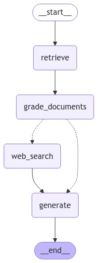

# C-RAG: Corrective Retrieval Augmented Generation



C-RAG (Corrective Retrieval Augmented Generation) is a powerful framework designed to improve generative AI models by combining semantic search, corrective reasoning, web search capabilities, and intelligent document generation. The framework ensures that the responses are both accurate and enriched with validated context from multiple sources. It leverages **Chroma** as the **vector database** to efficiently retrieve semantically relevant documents and uses state-of-the-art reasoning models to enhance response quality.

---

## 🗂️ Nodes Explained

### 1. **Document Retrieval**  
- **Description:**  
  This node performs **semantic search** over the knowledge base using document embeddings stored in **Chroma**. It identifies and retrieves the most relevant documents based on the user's query.  
- **Key Technology:**  
  - **Chroma** as the vector database for fast and accurate semantic similarity matching.

### 2. **Document Grading (CoT - Chain of Thought Reasoning)**  
- **Description:**  
  After retrieving documents, this step evaluates and grades the relevance and quality of the documents using **Chain of Thought (CoT)** reasoning. Only the best documents are passed forward for generating the response.  
- **Purpose:**  
  This ensures that the system corrects any misinformation by relying on the highest-quality sources.

### 3. **Web Search (Tavily Integration)**  
- **Description:**  
  If the retrieved documents do not fully address the query, the system performs a **web search** using Tavily. This step supplements the response with up-to-date, web-based information.  

### 4. **Generate**  
- **Description:**  
  Using the retrieved, graded, and possibly enriched documents, the system generates a corrected and accurate response.

---

## 🔧 Features and Highlights

- **Chroma Vector DB:**  
  - Efficient storage and retrieval of embeddings for semantic search.
  - Provides quick access to relevant documents with low latency.

- **Chain of Thought Reasoning:**  
  - CoT reasoning enables the system to correct and refine the retrieved information through structured thought processes.

- **Tavily Web Search:**  
  - Ensures that responses remain relevant and up-to-date by fetching information directly from the web when necessary.

---

## 🚀 Usage

### Step 1: Clone the Repository
```bash
git clone https://github.com/vinay-gatech/corrective-rag.git
cd corrective-rag
```

### Step 2: Create and Activate Virtual Environment
Creating a virtual environment helps manage dependencies.

#### On Linux / macOS:
```bash
python3 -m venv venv
source venv/bin/activate
```

#### On Windows:
```bash
python -m venv venv
venv\Scripts\activate
```

### Step 3: Install Dependencies
Navigate to the `src` directory and install the required dependencies:

```bash
cd src
pip install -r requirements.txt
```

### Step 4: Run the C-RAG Flow
- Store your documents as embeddings in **Chroma**.
- Start the system to handle queries using the corrective retrieval and generation process, including document grading and optional web search.

---

## 📊 Flow Diagram

Below is the flow diagram illustrating the C-RAG process:


---

## 🛠️ Future Improvements

- Support for multi-modal retrieval (text, images, videos).
- Explore additional vector search engines like FAISS or Milvus.
- Improve CoT reasoning through more advanced LLM backends.

---

## 🤝 Contributing

Contributions are welcome! Please feel free to submit pull requests for any new features or improvements.

---
